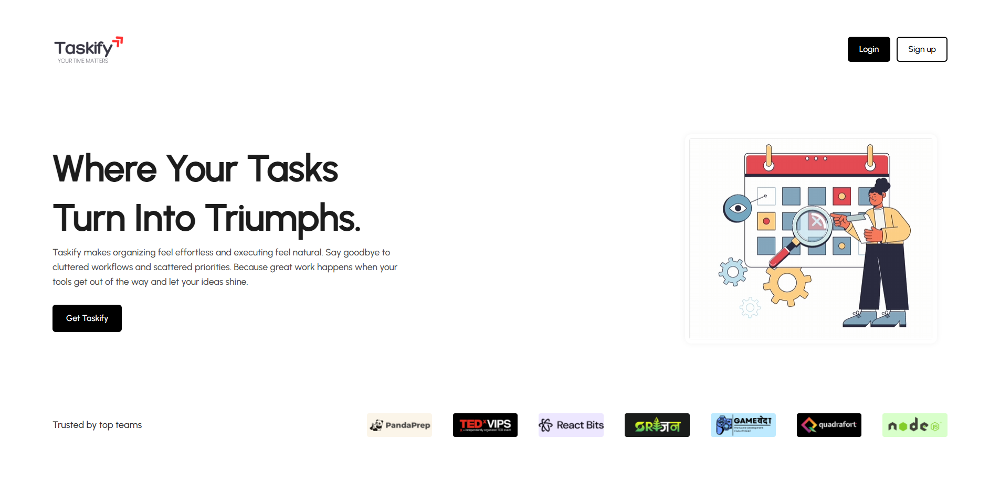
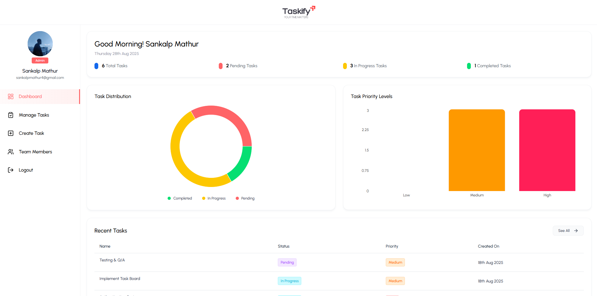
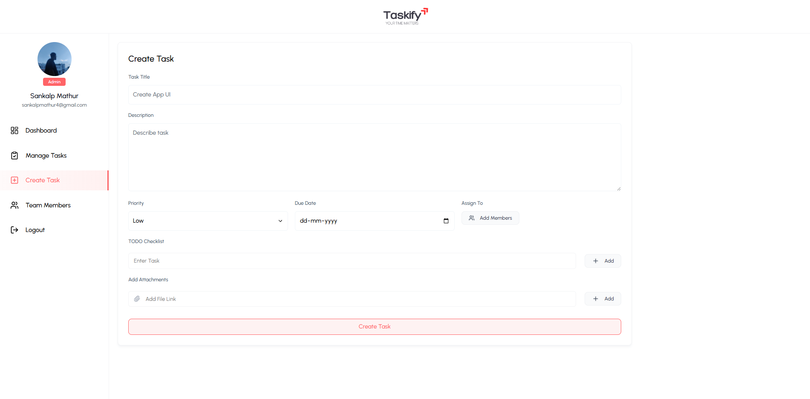
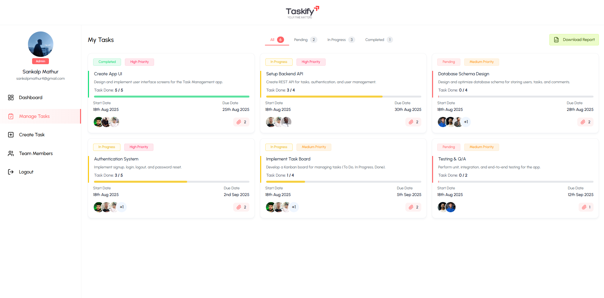
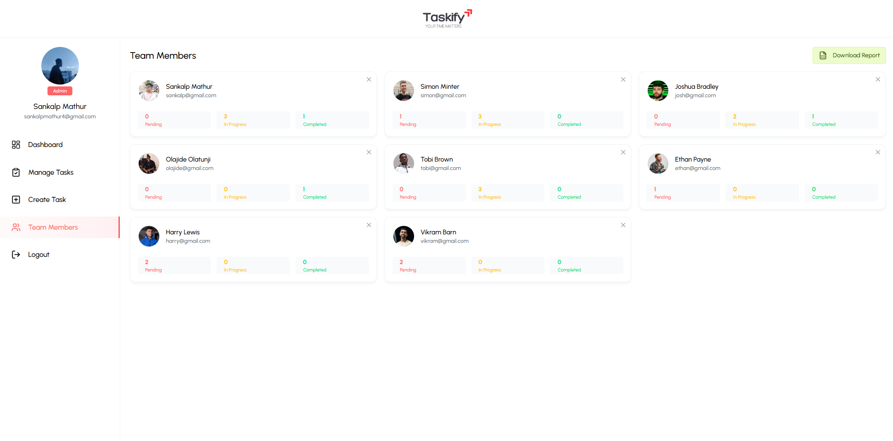
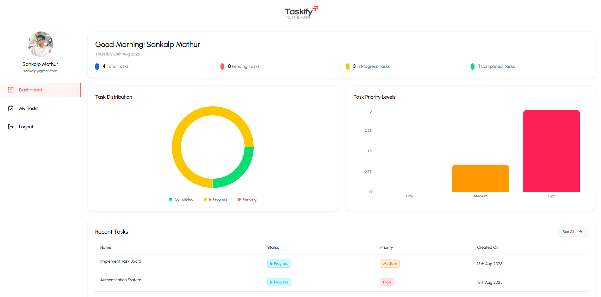
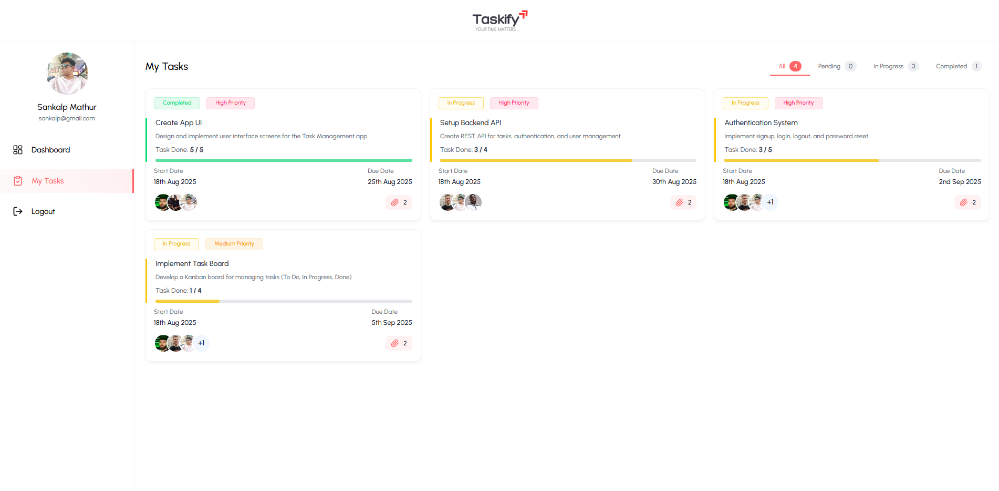

# Taskify – Task Manager Application

The **Task Manager Application** is a full-stack web-based solution designed to help **teams and individuals** organize, assign, and track tasks effectively. The application demonstrates end-to-end development using the **MERN stack**, with a strong focus on secure authentication, role-based dashboards, and responsive design.  

---

## 🚀 Features  

- 🔑 **Authentication & Authorization** – Secure login/signup with JWT-based authentication and role-based access. Admin registration is restricted via a special access code.  
- ✅ **Task Management (CRUD)** – Create, view, update, and delete tasks with support for deadlines, statuses, and priority levels.  
- 📂 **Task Categorization** – Tasks are organized into **Pending**, **In Progress**, and **Completed** states.  
- 👥 **Role-Based Dashboards** –  
  - **User Dashboard** – Displays personal tasks, progress statistics, and task distribution.  
  - **Admin Dashboard** – Provides full task management (create, assign, prioritize, update, delete) with team-wide visibility.  
- 📊 **Analytics & Visuals** – Interactive charts and graphs for productivity insights.  
- 🧑‍🤝‍🧑 **Team Management** – Admins can manage members and assign tasks directly.  
- ⚡ **Real-Time Updates** – Frontend integrated with backend APIs for smooth and responsive task flows.  

---

## 🛠️ Tech Stack  

- **Frontend:** React.js + Tailwind CSS  
- **Backend:** Node.js + Express.js  
- **Database:** MongoDB  
- **Authentication:** JWT (Role-Based Access Control)  
- **Integration:** Axios for API communication  
- **Deployment:** Vercel (Frontend) / Render (Backend)  

---

## 📸 Screenshots

### 🏠 Landing Page
  
**Description:** Clean and modern landing page introducing Taskify with call-to-action buttons.

---

### 📊 Admin Dashboard
  
**Description:** Overview of all tasks with progress charts, task distribution, and quick stats for admins.

---

### ✍️ Create Task
  
**Description:** Interface for creating new tasks with title, description, priority, due date, checklist, and attachments.

---

### 📂 Manage Tasks
  
**Description:** Kanban-style task management board showing all tasks categorized as Pending, In Progress, and Completed.

---

### 👥 Team Members
  
**Description:** Team management view displaying members with their assigned tasks and statuses.

---

### 👤 User Dashboard
  
**Description:** Personalized dashboard for individual users showing their task statistics and progress.

---

### ✅ User Tasks
  
**Description:** Task board for users to manage their own assigned tasks with progress tracking.

---

👉 This project showcases **full-stack development, secure authentication, real-time updates, and clean UI/UX design** – making productivity **organized, collaborative, and efficient**.  
